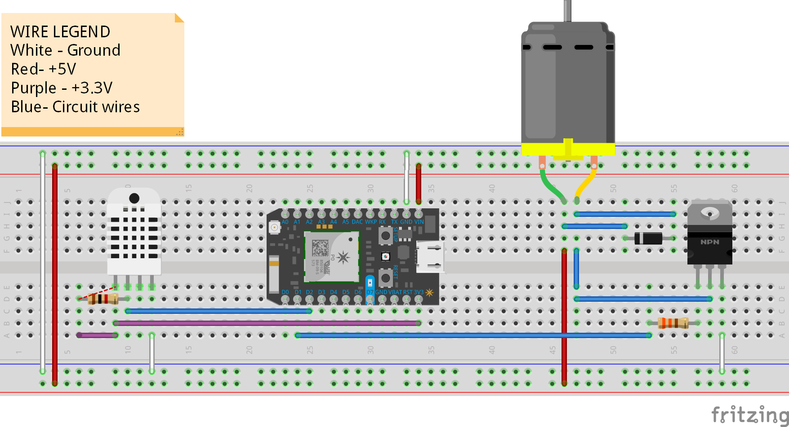

# Readme

This project adheres to an [MIT License](LICENSE).

## About

The circuit in this project connects a DHT22 sensor and a DC motor to a Particle Photon. The readings from the sensor are reported to the users particle cloud and can be viewed on the dashboard. The motor can be controlled through the cloud interface as well, and there is an app which can be used for this purpose.

## Parts

1. Particle Photon x 1
2. DHT 22 Humidity and Temperature Sensor x 1
3. 6V DC Motor
4. 1 k ohm resistor
5. 330 ohm resistor
6. 1N4001 Diode
7. TIP31C IC
6. 1 breadboard

## Related Repositories

1. [Particle Photon Firmware](https://github.com/Aditya90/GardenWatering-Firmware)
2. [Ionic app for control](https://github.com/Aditya90/GardenWatering-WebUi)